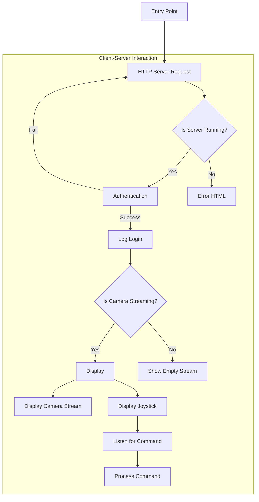

# Table of Contents
- [Table of Contents](#table-of-contents)
- [Designing](#designing)
  - [Computer Vision](#computer-vision)
  - [Live Web Server](#live-web-server)
  - [Hardware Components](#hardware-components)
  - [Classes Diagram](#classes-diagram)

# Designing
**Goal:** Create a robust, scalable, and maintainable system for efficiently handling web requests, controller commands, and object detection.

## Computer Vision
**Description:** Using `.NET Interactive` and `Emgu.CV`, I will create a prototype implementation of how the libraries will be used. Here are my notebook sandboxes:
1. [Investigations/FacialImageDetections.ipynb](Investigations/FacialImageDetections.ipynb)
2. [Investigations/FacialRealTimeDetections.ipynb](Investigations/FacialRealTimeDetections.ipynb)

## Live Web Server
**Description:** This section outlines the architecture of a live web server designed using C# and `ASP.NET` framework. We will detail the architecture with visuals to make the implementation phase more efficient.



## Hardware Components
**Description:** For now, the software will be deployed on my desktop PC with my default camera. Once it is reliably functioning, I will deploy my code on a Raspberry PI. Once deployed, I will work on the joystick implementation.

## Classes Diagram
**Description:** This section outlines how the implementation will be separated by respective class.

```puml
todo
```