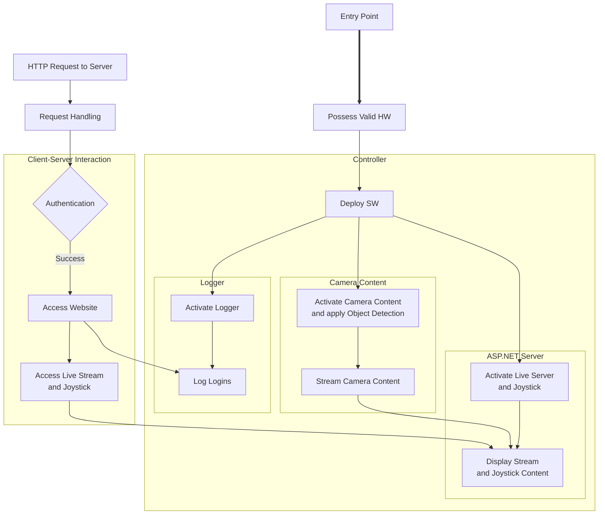

# Table of Contents
- [Table of Contents](#table-of-contents)
- [Pet Surveillance Bot](#pet-surveillance-bot)
  - [High-Level Overview](#high-level-overview)

# Pet Surveillance Bot
**Project Goal:** Using *only* C#, create a publicly accessible live server to control the movement of a streaming robotic device that has pet recognition and movement detection capabilities. 
- Design: [Design/SoftwareDesign.md](/Design/SoftwareDesign.md)
- Implementation: [Source/]()

## High-Level Overview

