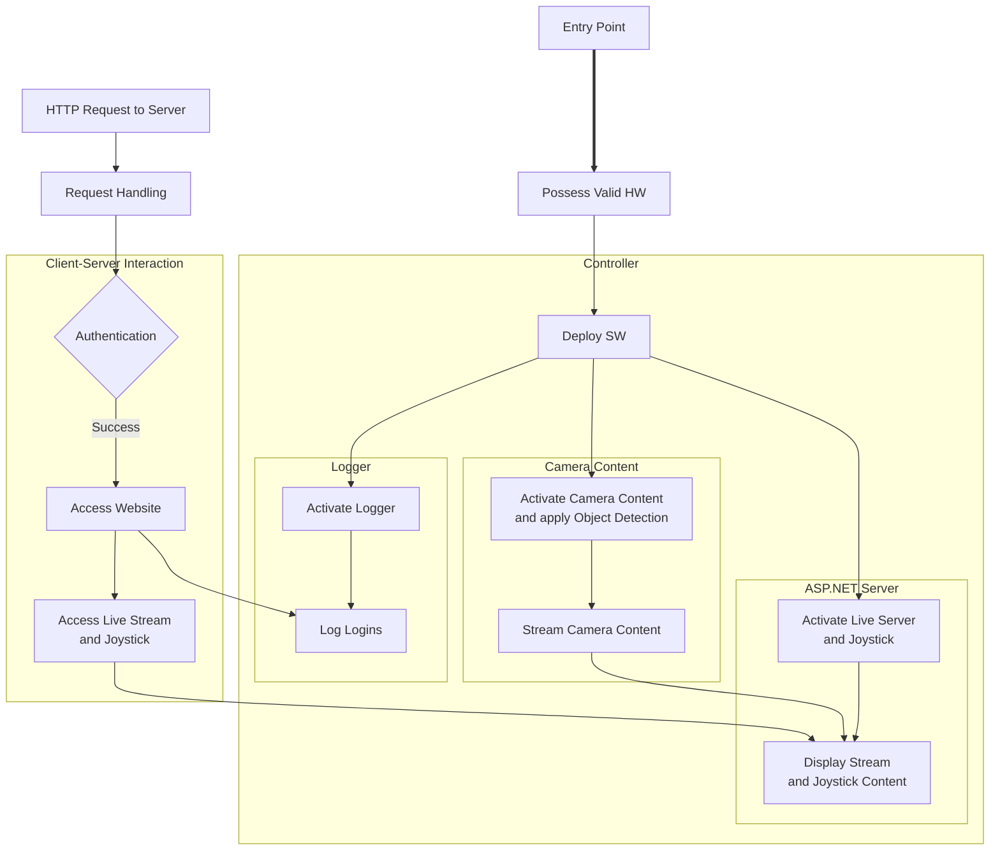

# Table of Contents
- [Table of Contents](#table-of-contents)
- [Surveillance Bot](#surveillance-bot)
  - [Installation and Deployment](#installation-and-deployment)
    - [Windows](#windows)
  - [High-Level Overview](#high-level-overview)

# Surveillance Bot
**Project Goal:** Using *only* C#, create a publicly accessible live server to control the movement of a streaming robotic device that has pet/person recognition and movement detection capabilities.
- Installation: [Build/](/Build/)
- Implementation: [Source/](/Source/)
- Documentation: [Documentation/SoftwareDesign.md](/Documentation/SoftwareDesign.md)
  - Investigations: [Documentations/Investigations/](/Documentation/Investigations/)
  
## Installation and Deployment
### Windows
1. Install [.NET 8.0](https://dotnet.microsoft.com/en-us/download/dotnet/thank-you/sdk-8.0.300-windows-x64-installer) and run the deployment script via PowerShell:
   
   ```powershell
   git clone https://github.com/Leal-Daniel/SurveillanceBot.git $env:USERPROFILE\Downloads\repo
   cd $env:USERPROFILE
   Set-ExecutionPolicy -Scope CurrentUser -ExecutionPolicy Bypass
   .\Downloads\repo\Build\WindowsDeployment.ps1

   ```

   **NOTE:** This should open a website with URL `http://localhost:[PORT_NUMBER]` when completed.
2. Setup online video monitoring using tunneling:
   1. Activate the tunnel (will output your server's public URL):
  
      ```powershell
      lt --port [PORT_NUMBER]
      ```
   2. Paste the output URL into your browser and get the tunnel password:
   
      ```powershell
      curl https://loca.lt/mytunnelpassword
      ```
   3. Paste the password into the box prompted by your server URL.

## High-Level Overview

