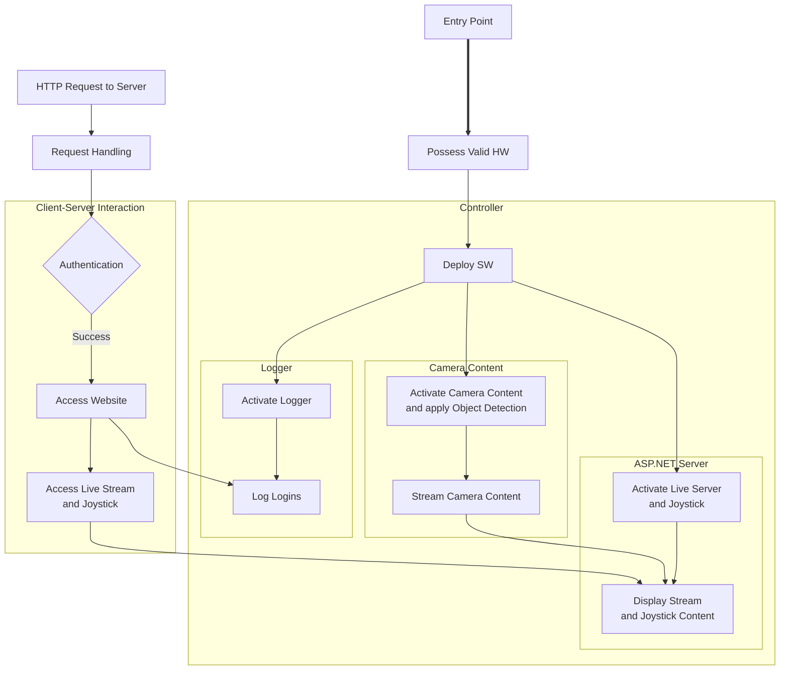

# Table of Contents
- [Table of Contents](#table-of-contents)
- [Pet Surveillance Bot](#pet-surveillance-bot)
  - [Installation and Deployment](#installation-and-deployment)
    - [Windows](#windows)
  - [High-Level Overview](#high-level-overview)

# Pet Surveillance Bot
**Project Goal:** Using *only* C#, create a publicly accessible live server to control the movement of a streaming robotic device that has pet recognition and movement detection capabilities. 
- Implementation: [Source/]()
- Documentation: [Documentation/SoftwareDesign.md](/Documentation/SoftwareDesign.md)
  - Investigations: [Documentations/Investigations/](/Documentation/Investigations/)
  
## Installation and Deployment
### Windows
1. Install [.NET 8.0](https://dotnet.microsoft.com/en-us/download/dotnet/thank-you/sdk-8.0.300-windows-x64-installer) and clone the repository:
   ```powershell
   git clone https://github.com/Leal-Daniel/PetSurveillanceBot.git $env:USERPROFILE\Downloads\repo
   ```
3. Run the script via PowerShell:
   ```powershell
   .\$env:USERPROFILE\Downloads\repo\Build\WindowsInstallation.ps1
   ```
4. Setup online video monitoring using tunneling:
   1. The script should open a website with URL: `http://localhost:[PORT_NUMBER]`.
   2. Access the live server by using the URL provided after activating the tunnel: `lt --port [PORT_NUMBER]`
   3. Get the tunnel password `curl https://loca.lt/mytunnelpassword`

## High-Level Overview

